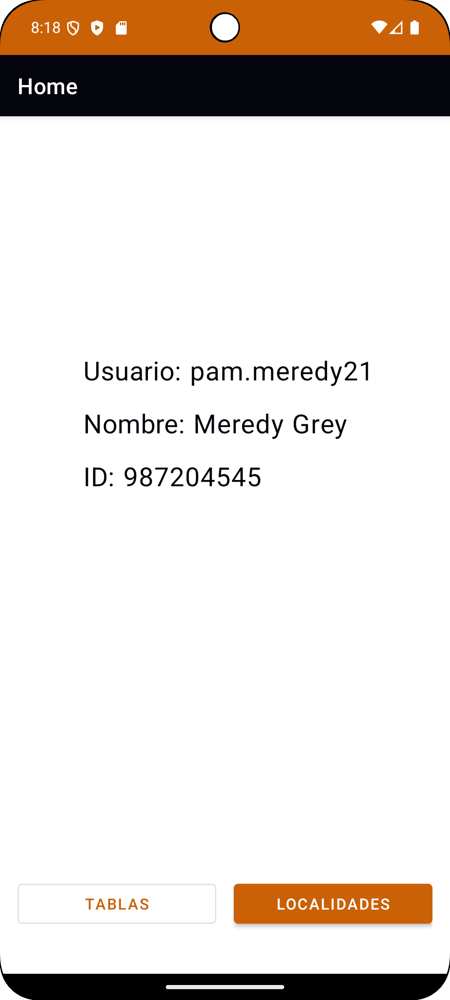
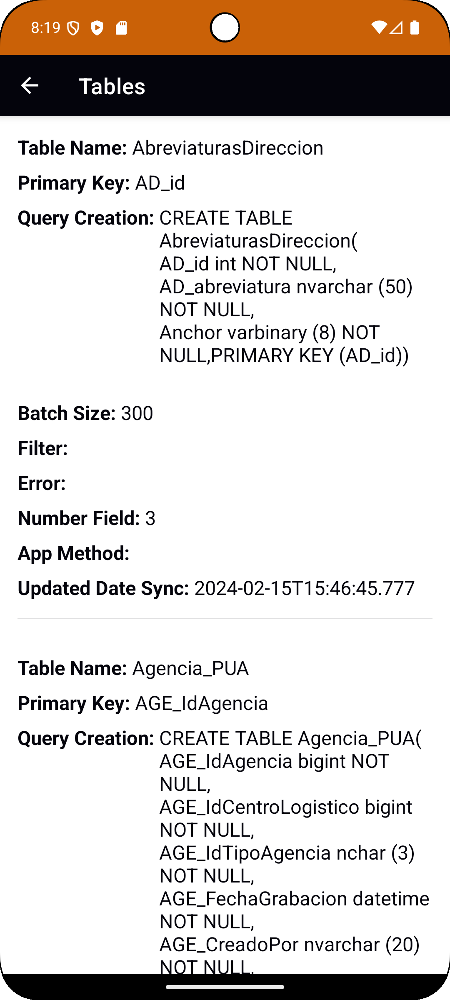
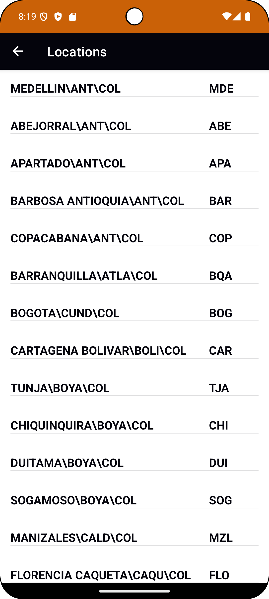

# Prueba InterRapidísimo Android App

An Android application developed as a technical test for InterRapidísimo, demonstrating user information display and management of local data tables.

## Features

*   Displays user information (Username, Name, ID).
*   Shows a list of configurable "Tables" stored locally.
    *   Each table entry displays details like Table Name, Primary Key, Query Creation, Batch Size, etc.
*   Allows deletion of all table data.
*   Modern UI built with Material Components.

## Home Screen

## Tables List Screen

## Locations Screen

## Technologies Used

*   **Kotlin:** Primary programming language.
*   **Android Jetpack:**
    *   **UI Layer:** Fragments, RecyclerView, ConstraintLayout, View Binding.
    *   **Architecture Components:** ViewModel, Flow.
    *   **Navigation Component:** Jetpack navigation component.
*   **Material Components for Android:** For modern UI elements and styling.
*   **Hilt:** For dependency injection.
*   **SQLite:** For local data storage.
*   **Coroutines:** For asynchronous operations.
*   **Retrofit:** For API communication.

## Architecture

This application follows the recommended Android app architecture pattern (MVVM - Model-View-ViewModel) to promote a separation of concerns, making the codebase more testable and maintainable.

*   **UI Layer (Fragments/Activities):** Responsible for displaying data and forwarding user interactions to the ViewModel.
*   **ViewModel:** Holds and manages UI-related data in a lifecycle-conscious way. It communicates with the Data layer.
*   **Data Layer (Repositories, DAOs):** Responsible for providing data to the ViewModel, abstracting data sources (local SQLite database).
    *   `TableModelDao`: Handles CRUD operations for `TableModel` entities.
*   **Shared Preferences:** For storing user data.
